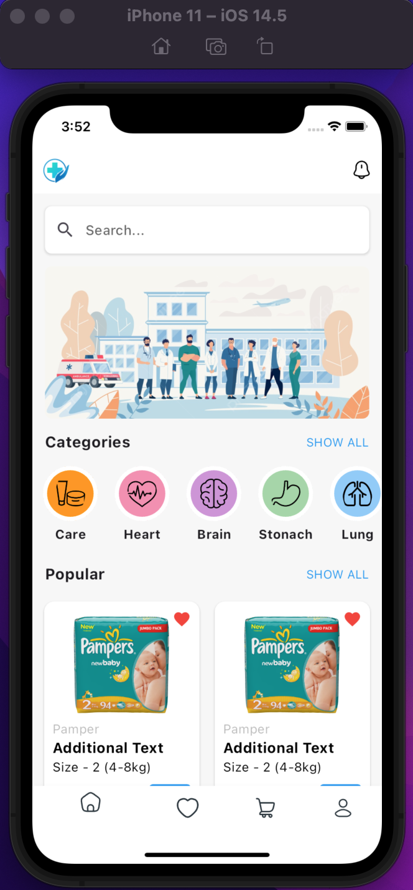
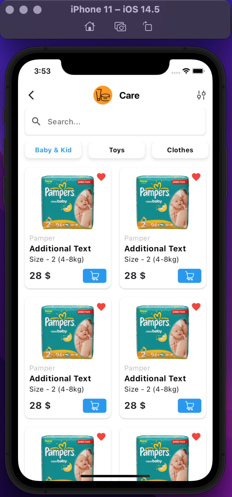

# Design UI for (Midterm Example)

## Screens

Below are screenshots of the Home and Cart screens for the application.

  
  

## Installation and Running

Follow these steps to clone and set up the project on your local machine.

# Clone the repository

git clone https://github.com/Ing-China/Flutter_Design_UI_Midterm_App.git

# Go to that folder

cd Flutter_Design_UI_Midterm_App

# Install dependencies

flutter pub get

# Run on Android

flutter run

# Run on iOS

flutter run
